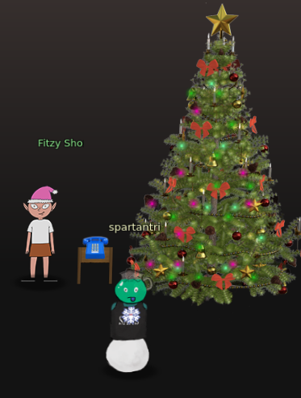
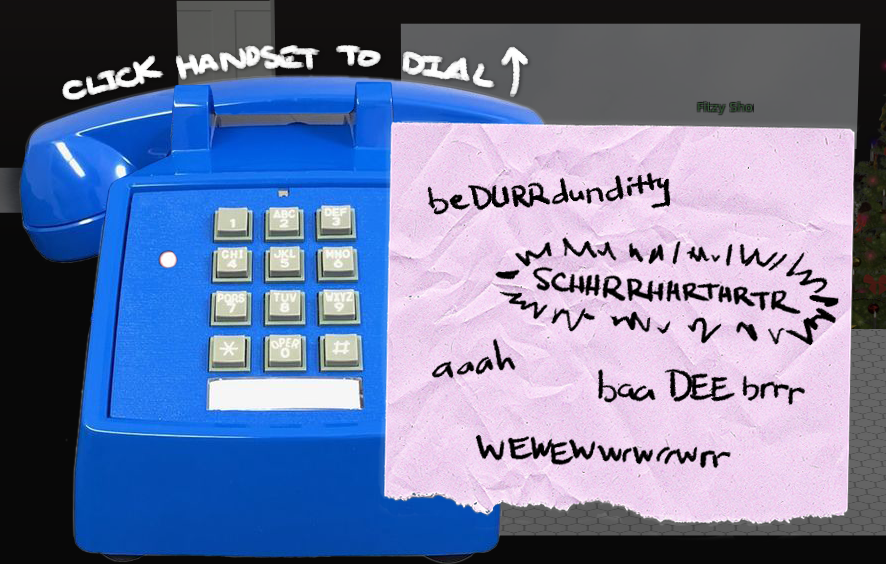

# 33.6kbps
This challenge is about completing a modem handshake to turn on the pine tree lights. The elfs give hints about which number to dial and also there is a recording of a previous recording.

## Handshake sequence
Using the handshake audio recorded we should click on the different icons to reproduce a similar noise than that of the modem handshake.

Click on the handset and dial `7568347`

Then click on the different words in the following sequence.

* 1 ba dee br 
* 2 aaah
* 3 Wewewwwrrrwrrr
* 4 bedDURRdunditty
* 5 SCHHRRHHRTHRTR

Once the handhake is completed the tree lights will turn on and performing the same challenge again will change the tree lights to a different color.