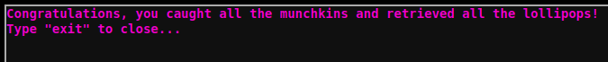

# Linux Primer
This challenge requires to perform a series of tasks in the linux command line


### task 1
Perform a directory listing of your home directory to find a munchkin and retrieve a lollipop!
```
elf@fc41807707ff:~$ ls
HELP  munchkin_19315479765589239  workshop
```

### task 2
Now find the munchkin inside the munchkin.
```
elf@fc41807707ff:~$ cat munchkin_19315479765589239 
munchkin_24187022596776786
```

### task 3
Great, now remove the munchkin in your home directory.
```
elf@fc41807707ff:~$ rm munchkin_19315479765589239
```

### task 4
Print the present working directory using a command.
```
elf@fc41807707ff:~$ pwd
/home/elf
```

### task 5
Good job but it looks like another munchkin hid itself in you home directory. Find the hidden munchkin!
```
elf@fc41807707ff:~$ ls -a
.  ..  .bash_history  .bash_logout  .bashrc  .munchkin_5074624024543078  .profile  HELP  workshop
```

### task 6
Excellent, now find the munchkin in your command history.
```
elf@fc41807707ff:~$ history|grep munchkin
    1  echo munchkin_9394554126440791
    3  cat munchkin_19315479765589239 
    4  rm munchkin_19315479765589239 
    8  history|grep munchkin
```

### task 7
Find the munchkin in your environment variables.
```
elf@fc41807707ff:~$ env |grep munchkin
z_MUNCHKIN=munchkin_20249649541603754
```

### task 8
Next, head into the workshop.
```
elf@fc41807707ff:~$ cd workshop
```

### task 9
A munchkin is hiding in one of the workshop toolboxes. Use "grep" while ignoring case to find which toolbox the munchkin is in.
```
elf@fc41807707ff:~/workshop$ grep -i munchkin *
grep: electrical: Is a directory
toolbox_191.txt:mUnChKin.4056180441832623
```

### task 10
A munchkin is blocking the lollipop_engine from starting. Run the lollipop_engine binary to retrieve this munchkin.
```
elf@fc41807707ff:~/workshop$ ls -al lollipop_engine
-r--r--r-- 1 elf elf 5692640 Dec 10 18:19 lollipop_engine
elf@fc41807707ff:~/workshop$ chmod +x lollipop_engine
elf@fc41807707ff:~/workshop$ ./lollipop_engine
munchkin.898906189498077
```

### task 11
Munchkins have blown the fuses in /home/elf/workshop/electrical. cd into electrical and rename blown_fuse0 to fuse0.
```
elf@fc41807707ff:~/workshop$ cd electrical/
elf@fc41807707ff:~/workshop/electrical$ mv blown_fuse0 fuse0
```

### task 12
Now, make a symbolic link (symlink) named fuse1 that points to fuse0
```
elf@fc41807707ff:~/workshop/electrical$ ln -s fuse0 fuse1
```

### task 13
Make a copy of fuse1 named fuse2.
```
elf@fc41807707ff:~/workshop/electrical$ cp fuse1 fuse2
```

### task 14
We need to make sure munchkins don't come back. Add the characters "MUNCHKIN_REPELLENT" into the file fuse2.
```
elf@fc41807707ff:~/workshop/electrical$ echo "MUNCHKIN_REPELLENT" >> fuse2
```

### task 15
Find the munchkin somewhere in /opt/munchkin_den.
```
elf@38049d8f110c:/opt/munchkin_den$ find . |grep -i munch
./apps/showcase/src/main/resources/mUnChKin.6253159819943018
```

### task 16
Find the file somewhere in /opt/munchkin_den that is owned by the user munchkin.
```
elf@38049d8f110c:/opt/munchkin_den$ ls -Ral |grep munchkin
-rw-r--r-- 1 munchkin munchkin    0 Dec 10 18:20 niKhCnUm_9528909612014411
```

### task 17
Find the file created by munchkins that is greater than 108 kilobytes and less than 110 kilobytes located somewhere in /opt/munchkin_den.
```
elf@38049d8f110c:/opt/munchkin_den$ find . -size +108k -size -110k
./plugins/portlet-mocks/src/test/java/org/apache/m_u_n_c_h_k_i_n_2579728047101724
```

### task 18
List running processes to find another munchkin.
```
elf@38049d8f110c:/opt/munchkin_den$ ps -fea
UID        PID  PPID  C STIME TTY          TIME CMD
init         1     0  0 01:09 pts/0    00:00:00 /usr/bin/python3 /usr/local/bin/tmuxp load ./mysession.yaml
elf      19811 19808  0 02:03 pts/2    00:00:00 /usr/bin/python3 /14516_munchkin
elf      21649   319  0 02:04 pts/3    00:00:00 ps -fea
```

### task 19
The 14516_munchkin process is listening on a tcp port. Use a command to have the only listening port display to the screen.
```
elf@38049d8f110c:/opt/munchkin_den$ netstat -antp
(Not all processes could be identified, non-owned process info
 will not be shown, you would have to be root to see it all.)
Active Internet connections (servers and established)
Proto Recv-Q Send-Q Local Address           Foreign Address         State       PID/Program name    
tcp        0      0 0.0.0.0:54321           0.0.0.0:*               LISTEN      19811/python3  
```

### task 20
The service listening on port 54321 is an HTTP server. Interact with this server to retrieve the last munchkin.
```
elf@38049d8f110c:/opt/munchkin_den$ curl 0.0.0.0:54321
munchkin.73180338045875
```

### task 21
Your final task is to stop the 14516_munchkin process to collect the remaining lollipops.
```
elf@38049d8f110c:/opt/munchkin_den$ kill -9 19811
```


