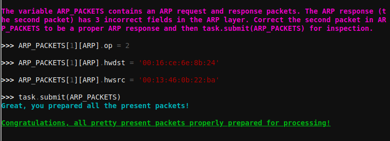

# Scapy Prepper
This challenge teaches the use of scapy to manipulate packets and it gives some hints for challenge 9 ARP Shenanigans.
```
╔════════════════════════════════════════════════════════════════╗
║  ___ ___ ___ ___ ___ _  _ _____   ___  _   ___ _  _____ _____  ║
║ | _ \ _ \ __/ __| __| \| |_   _| | _ \/_\ / __| |/ / __|_   _| ║
║ |  _/   / _|\__ \ _|| .` | | |   |  _/ _ \ (__| ' <| _|  | |   ║
║ |_| |_|_\___|___/___|_|\_| |_|   |_|/_/ \_\___|_|\_\___| |_|   ║
║                ___                                             ║
║               | _ \_ _ ___ _ __ _ __  ___ _ _                  ║
║               |  _/ '_/ -_) '_ \ '_ \/ -_) '_|                 ║
║               |_| |_| \___| .__/ .__/\___|_|                   ║
║                           |_|  |_|                             ║
║                (Packets prepared with scapy)                   ║
╚════════════════════════════════════════════════════════════════╝
Type "yes" to begin.
```


## Solution

### Q1
Q1 : Welcome to the "Present Packet Prepper" interface! The North Pole could use your help preparing present packets for shipment.
Start by running the task.submit() function passing in a string argument of 'start'.
Type task.help() for help on this question.
=> task.submit("start")

### Q2
Q2 : Submit the class object of the scapy module that sends packets at layer 3 of the OSI model.
=> task.submit(send)

### Q3
Q3 : Submit the class object of the scapy module that sniffs network packets and returns those packets in a list.
=> task.submit(sniff)

### Q4
Q4 : Submit the NUMBER only from the choices below that would successfully send a TCP packet and then return the first sniffed response packet to be stored in a variable named "pkt":
1. pkt = sr1(IP(dst="127.0.0.1")/TCP(dport=20))
2. pkt = sniff(IP(dst="127.0.0.1")/TCP(dport=20))
3. pkt = sendp(IP(dst="127.0.0.1")/TCP(dport=20))
=> task.submit(1)

### Q5
Q5 : Submit the class object of the scapy module that can read pcap or pcapng files and return a list of packets.
=> task.submit(rdpcap)

### Q6
Q6 : The variable UDP_PACKETS contains a list of UDP packets. Submit the NUMBER only from the choices below that correctly prints a summary of UDP_PACKETS:
1. UDP_PACKETS.print()
2. UDP_PACKETS.show()
3. UDP_PACKETS.list()
=> task.submit(2)

### Q7
Q7 : Submit only the first packet found in UDP_PACKETS.
=> task.submit(UDP_PACKETS[0])

### Q8
Q8 : Submit only the entire TCP layer of the second packet in TCP_PACKETS.
=> task.submit(TCP_PACKETS[IP][1][TCP])

## Q9
Q9 : Change the source IP address of the first packet found in UDP_PACKETS to 127.0.0.1 and then submit this modified packet
=> task.submit(UDP_PACKETS[0])   worked but shouldn't have ^^

## Q10
Q10 : Submit the password "task.submit('elf_password')" of the user alabaster as found in the packet list TCP_PACKETS.
=> TCP_PACKETS[6][Raw].load
=> task.submit('echo')

## Q11
Q11 : The ICMP_PACKETS variable contains a packet list of several icmp echo-request and icmp echo-reply packets. Submit only the ICMP chksum value from the second packet in the ICMP_PACKETS list.
=> task.submit(ICMP_PACKETS[1][ICMP].chksum)

## Q12
Q12 : Submit the number of the choice below that would correctly create a ICMP echo request packet with a destination IP of 127.0.0.1 stored in the variable named "pkt"
1. pkt = Ether(src='127.0.0.1')/ICMP(type="echo-request")
2. pkt = IP(src='127.0.0.1')/ICMP(type="echo-reply")
3. pkt = IP(dst='127.0.0.1')/ICMP(type="echo-request")
=> task.submit(3)

## Q13
Q13 : Create and then submit a UDP packet with a dport of 5000 and a dst IP of 127.127.127.127. (all other packet attributes can be unspecified)
=> task.submit(IP(dst='127.127.127.127')/UDP(dport=5000))

## Q14
Q14 : Create and then submit a UDP packet with a dport of 53, a dst IP of 127.2.3.4, and is a DNS query with a qname of "elveslove.santa". (all other packet attributes can be unspecified)
=> task.submit(IP(dst='127.2.3.4')/UDP(dport=53)/DNS(rd=1,qd=DNSQR(qname="elveslove.santa")))

## Q15
Q15 : The variable ARP_PACKETS contains an ARP request and response packets. The ARP response (the second packet) has 3 incorrect fields in the ARP layer. Correct the second packet in ARP_PACKETS to be a proper ARP response and then task.submit(ARP_PACKETS) for inspection.
=> ARP_PACKETS[1][ARP].op = 2
=> ARP_PACKETS[1][ARP].hwdst = '00:16:ce:6e:8b:24'
=> ARP_PACKETS[1][ARP].hwsrc = '00:13:46:0b:22:ba'
=> task.submit(ARP_PACKETS)

