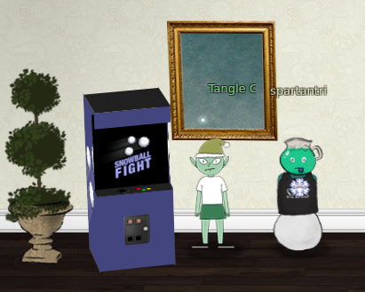
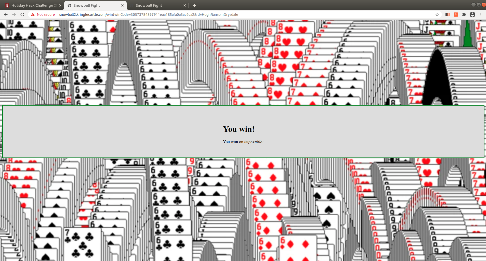

# Snowball game



The snowball game in the easy level will generate the same layout over and over if the same name is used, in the hard level you cannot pick the name, it is automatically assigned to an integer number, if that same name is entered in another tab in the easy level the easy level will also have the exact same layout.

In the impossible level you cannot see the name but in the source code of the /game page you can see a list of 623 integers except the last one which is the chosen one to generate the layout.

[Random predict script](mt19937predictorSnowball.py)

Using the same MT19937 predictor as in challenge 11a as template, we enter the list of numbers in a text file and generate the next random and then open a new tab using that as name in the easy level. At this point we only need to take note of layout of the game at the easy level and use that to win the Impossible level!

## Random prediction
Script to generate the next random
```
import random
from mt19937predictor import MT19937Predictor
predictor = MT19937Predictor()
with open('snowball.txt') as nonces:
    for nonce in nonces.readlines():
        knownnonce=int(nonce)
        predictor.setrandbits(knownnonce, 32)
nextrandom=predictor.getrandbits(32)
print(str('%08.08x' % (nextrandom)))
print(nextrandom)
```

## Generate next number
```
python mt19937predictorSnowball.py
d5f31c25
3589479461
```

## Solved challenge
Use the predicted missing code `3589479461` in this case, and use it in another window in the `Easy` level at the Snowball challenge source page https://snowball2.kringlecastle.com/, to have the achievement unlocked the game should be won at the impossible level inside the `iframe` on the kringlecon page.

