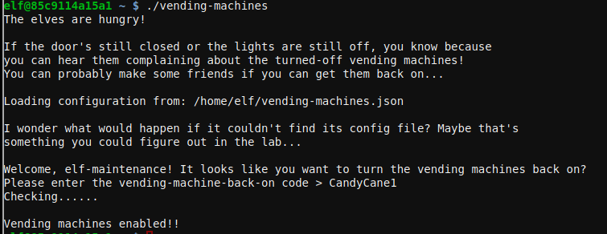

# Speaker UNPrep
This console contains multiple challenges, `door`, `lights` and `vending-machines`.


The `door` challenge opens the door to the UNPrep Speaker room, once the room opens the light is turned off. Solving the `lights` challenge will turn on the lights and enable the `Snowball` game. Then solving the `vending-machines` challenge will enable the vending machine that will give us the red and blue `orbs` for the santavator.


## Door challenge
The binary `door` contained the password end can be extracted with `strings`.
```
elf@85c9114a15a1 ~ $ strings door |grep -i password
/home/elf/doorYou look at the screen. It wants a password. You roll your eyes - the 
password is probably stored right in the binary. There's gotta be a
Be sure to finish the challenge in prod: And don't forget, the password is "Op3nTheD00r"
Beep boop invalid password
```
The to unlock the achievement we simply run the binary and enter the discovered password.
```
elf@85c9114a15a1 ~ $ ./door 
You look at the screen. It wants a password. You roll your eyes - the 
password is probably stored right in the binary. There's gotta be a
tool for this...

What do you enter? > Op3nTheD00r
Checking......

Door opened!
```

ANSWER: `Op3nTheD00r`


## Lights challenge
The `lights` binary uses a complementary `lights.conf` file that contains two fields `name` and `password`, after entering the string in cyberchef it did not get much out of it but the hints tells you can modify the files in `/lab` so we use teh same string that is in the `password` for the `name` and after running the challenge again it greets us with the password `Computer-TurnLightsOn`.

To unlock the achievement, we run the challenge using the password.
```
elf@85c9114a15a1 ~ $ ./lights 
The speaker unpreparedness room sure is dark, you're thinking (assuming
you've opened the door; otherwise, you wonder how dark it actually is)

You wonder how to turn the lights on? If only you had some kind of hin---

 >>> CONFIGURATION FILE LOADED, SELECT FIELDS DECRYPTED: /home/elf/lights.conf

---t to help figure out the password... I guess you'll just have to make do!

The terminal just blinks: Welcome back, elf-technician

What do you enter? > Computer-TurnLightsOn
Checking......

Lights on!
```

ANSWER: `Computer-TurnLightsOn`


## Vending-machine challenge
The vending machine does not unencrypt the password as the `lights` challenges but if the `vending-machines.json` configuration file is delted it asks for a user and passwords and creates a new file.

After entering a long password `AAAAAAAAAAAAAAAAAAAAAAAAAAAAAAAAAAAAAAA` it becomes evident that the same string repeats over and over giving which is a tell that we may be dealing with simple `XOR` or substitution mechanism in the back.

For example, when entering only `A`'s, the string that kept repeating is `XiGRehmw` in hex will be `19 28 06 13 24 29 2c 36`, but it's different that the one when using only `B` but it kept the patter of repetition every eight characters.

To make this quick lets simply loop thru the alphabet and numbers.

The brute forcing loop:
```
for p in `python -c 'for x in range(48,123): print(chr(x)*8)'`; do rm vending-machines.json ; echo -e "${p}\n${p}\n${p}\n" | ./vending-machines ;echo " test: $p"; grep pass vending-machines.json ; done |egrep "test:|password" > bruteforcer.txt
```

 
Now to find the what character was entered that matched the exact position of the password we use simple regular expressions to get the value of the nth character matching `LVEdQPpBwr` in the `vending-machines.json` , once we get to the 8th character we search for the next chanacter at the 1st position as the pattern loops every 8 characters.

The substitution finder:
```
elf@85c9114a15a1 ~/lab $ cat ../vending-machines.json 
{
  "name": "elf-maintenance",
  "password": "LVEdQPpBwr"
}

elf@85c9114a15a1 ~/lab $ grep -B1 "  \"password\": \"L" bruteforcer.txt 
 test: CCCCCCCC
  "password": "Lbn3UP9W"
elf@85c9114a15a1 ~/lab $ grep -B1 "  \"password\": \".V" bruteforcer.txt 
 test: aaaaaaaa
  "password": "9Vbtacpg"
elf@85c9114a15a1 ~/lab $ grep -B1 "  \"password\": \"..E" bruteforcer.txt 
 test: nnnnnnnn
  "password": "bhE62XDB"
elf@85c9114a15a1 ~/lab $ grep -B1 "  \"password\": \"...d" bruteforcer.txt 
 test: dddddddd
  "password": "ORLdlwWb"
elf@85c9114a15a1 ~/lab $ grep -B1 "  \"password\": \"....Q" bruteforcer.txt 
 test: yyyyyyyy
  "password": "iL5JQAMU"
elf@85c9114a15a1 ~/lab $ grep -B1 "  \"password\": \".....P" bruteforcer.txt 
 test: CCCCCCCC
  "password": "Lbn3UP9W"
elf@85c9114a15a1 ~/lab $ grep -B1 "  \"password\": \"......p" bruteforcer.txt 
 test: aaaaaaaa
  "password": "9Vbtacpg"
elf@85c9114a15a1 ~/lab $ grep -B1 "  \"password\": \".......B" bruteforcer.txt 
 test: nnnnnnnn
  "password": "bhE62XDB"
elf@85c9114a15a1 ~/lab $ grep -B1 "  \"password\": \"w" bruteforcer.txt 
 test: eeeeeeee
  "password": "wcZQAYue"
elf@85c9114a15a1 ~/lab $ grep -B1 "  \"password\": \".r" bruteforcer.txt 
 test: 11111111
  "password": "2rDO5LkI"
```

ANSWER: `CandyCane1`

