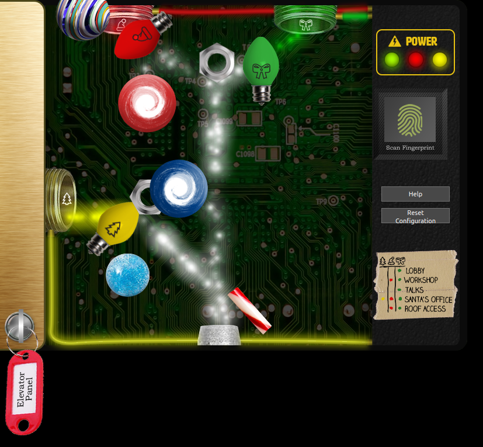

# 4) Operate the Santavator
Difficulty: 2/5

Talk to Pepper Minstix in the entryway to get some hints about the Santavator.

## Minimum items
Find the green bulb in courtyard.
Find the boltnut in front of elevator.

## Operating the santavator
To use the santavator you need to open the panel and make the stream of particles to fork into the right colors to activate the respective floors.

Wondering around the castle we will be able to find the different items, the first items found are one of the nuts and the green bulb and as we continue navigating the castle we find the red and yellow bulb, a candy cane, a blue ball, a magnetic bulb that we can arrange as shown on the image to enable the different elevator buttons.

Later in the game after solving the lights and vending machine challenges is possible to get from the vending machine a couple of extra items, the red and blue portals.

