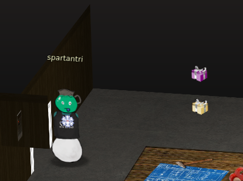
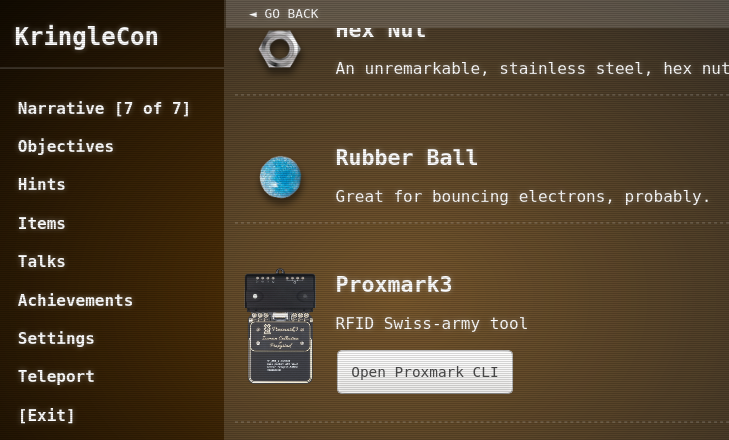
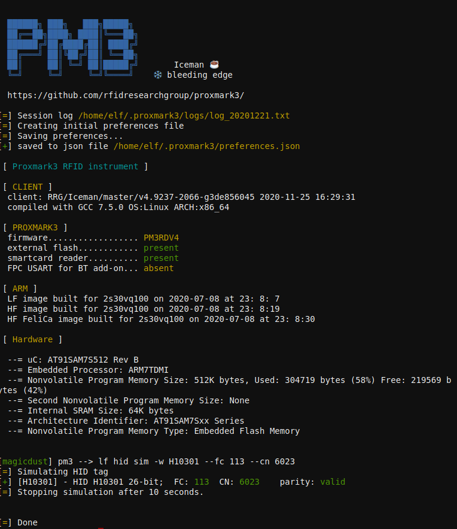
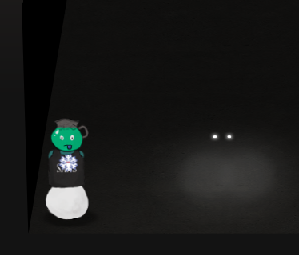

# 5) Open HID Lock
Difficulty: 2/5


Open the HID lock in the Workshop. Talk to Bushy Evergreen near the talk tracks for hints on this challenge. You may also visit Fitzy Shortstack in the kitchen for tips.



## Get the Proxmark3
Once we have the different light bulbs to enable the elevator workshop button, we can go there and use the Proxmark3 item we found.

## Use the Proxmark3 to acquire access card code
To use the proxmark item we need to be close to one of the items that restrict access or one of the avatars that has access cards to clone them with.



Some elfs have cards that can be useful.
```
Bow Ninecandle #db# TAG ID: 2006e22f0e (6023) - Format Len: 26 bit - FC: 113 - Card: 6023
Noel Boetie #db# TAG ID: 2006e22f08 (6020) - Format Len: 26 bit - FC: 113 - Card: 6020
```
Only Bow Ninecandle from the Talks floor has the right access. Stand close to him and read his card.

```
lf hid read
```

## Use the Proxmark3 to simulate a given access card
Stand next to the HID door in the workshop and try the cards
```
lf hid sim -w H10301 --fc 113 --cn 6023
lf hid sim -r 2006e22f0e
```



# Transform into Santa
Open the HID door and go all the way to the left then all the way down and click on the two lighting dots.

