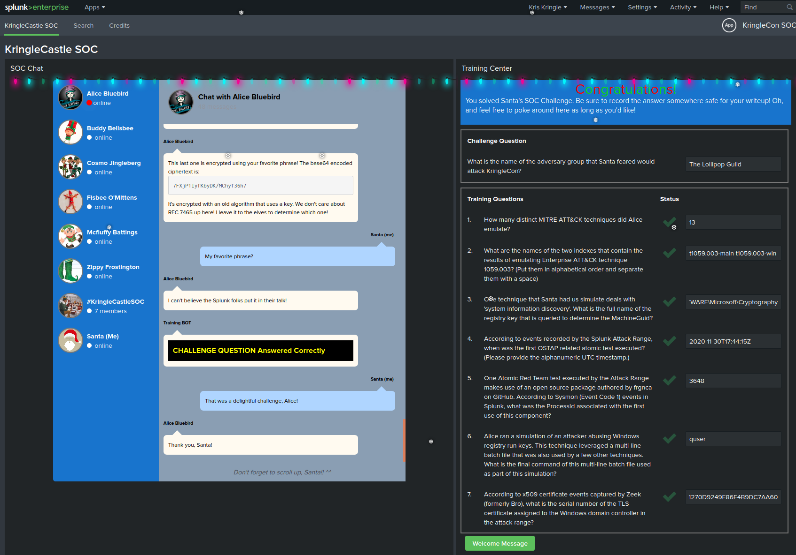

# 6) Splunk Challenge
Difficulty: 3/5

There is a photo of Santa's Desk on that billboard with his personal gift list. What gift is Santa planning on getting Josh Wright for the holidays? Talk to Jingle Ringford at the bottom of the mountain for advice.

ASWER : The Lollipop Guild

# Navigating Splunk
The `KringleCastle SOC` application contains several hitns to solve the challenges in the different chat conversations, after every solved question a new one will appear as well as new hints to solve the challenge.

### 1.	How many distinct MITRE ATT&CK techniques did Alice emulate? 
Request to solve :
| eventcount summarize=false index=* index=_* | dedup index | fields index
There are 27 results, but there may be duplicates and there are sub-techniques 
* 13

### 2.	What are the names of the two indexes that contain the results of emulating Enterprise ATT&CK technique 1059.003? (Put them in alphabetical order and separate them with a space)
Request to solve :
| eventcount summarize=false index=T1059.003*  | dedup index | fields index

* t1059.003-main t1059.003-win

### 3.  One technique that Santa had us simulate deals with 'system information discovery'. What is the full name of the registry key that is queried to determine the MachineGuid?
Request to solve :
index=t1082* CommandLine="*" * we see that there are REG QUERIES 
index=t1082* CommandLine="REG*"
* HKEY_LOCAL_MACHINE\SOFTWARE\Microsoft\Cryptography

### 4.	According to events recorded by the Splunk Attack Range, when was the first OSTAP related atomic test executed? (Please provide the alphanumeric UTC timestamp.)
Request to solve :
index=attack
index=attack "Test Name"="OSTAP*"
* 2020-11-30T17:44:15Z

### 5. One Atomic Red Team test executed by the Attack Range makes use of an open source package authored by frgnca on GitHub. According to Sysmon (Event Code 1) events in Splunk, what was the ProcessId associated with the first use of this component?

Clone the RedCanary repository and find the script related to audio and use the cmdlet name to search
Request to solve :
index=* EventID=1 "WindowsAudioDevice-Powershell-Cmdlet"
ProcessId 3648
* 3648

### 6. Alice ran a simulation of an attacker abusing Windows registry run keys. This technique leveraged a multi-line batch file that was also used by a few other techniques. What is the final command of this multi-line batch file used as part of this simulation?
Request to solve :
index=* EventID=1 CommandLine="*.bat*"

Clone the RedCanary repository and find the Discovery.bat
tail -3 ./T1074.001/src/Discovery.bat
systeminfo
qwinsta
quser
* quser

### 7. According to x509 certificate events captured by Zeek (formerly Bro), what is the serial number of the TLS certificate assigned to the Windows domain controller in the attack range
Request to solve :
index=* sourcetype=bro* 
index=* host=zeek sourcetype="bro:x509:json" "DC" "certificate.subject"="CN=win-dc-748.attackrange.local"| top limit=20 "certificate.serial"
* 55FCEEBB21270D9249E86F4B9DC7AA60

Challenge Question
What is the name of the adversary group that Santa feared would attack KringleCon?
Challenge given in chat: `7FXjP1lyfKbyDK/MChyf36h7`
Key given in talk: `Stay Frosty`

RC4 encryption
https://gchq.github.io/CyberChef/#recipe=From_Base64('A-Za-z0-9%2B/%3D',true)RC4(%7B'option':'UTF8','string':'Stay%20Frosty'%7D,'Latin1','Latin1')&input=N0ZYalAxbHlmS2J5REsvTUNoeWYzNmg3

ASWER : The Lollipop Guild

