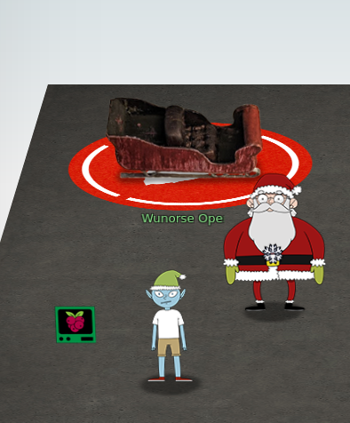

# 7) Solve the sleighs CAN-D-BUS
Difficulty: 3/5


Jack Frost is somehow inserting malicious messages onto the sleigh's CAN-D bus. We need you to exclude the malicious messages and no others to fix the sleigh. Visit the NetWars room on the roof and talk to Wunorse Openslae for hints.



# Finding the needle in the hey
The Sledge console displays numbers that can be filtered by entering the respective filters containing the hex codes. The possible filters are `ALL`, `Equals`, `Not Equal`, `Contains`, `Greater`, and `Less`.

By process of elimination check the ranges of each control but to eliminate the noise we set the following filters:
```
188# equals 000000000000
244# equals 000000000000
019# equals 000000000000
080# equals 000000000000
```

The first code that stands out is `19B#0000000F2057`, it spells out FROST in leet so we filter it as well. After setting all these initial settings there are no more readings if the controls are all set to the default values (`0`).

Now check the controls one by one, when testing the `Brake` control, it stands out that Break `080#` returns two different types of values `000001`-`000064` and another set of values starts to appear when the break is higher than `3`, all of them starting with `FFFF` so we add another filter for all `080#` values containing `FFFF` in the first two positions, the testing with the started sleigh and acceleration seems fine so now we remove the initial filters and boom Sleigh deFrosted!

Final Filters
```
19B# equals 0000000F2057
080# contains FFFF
```

